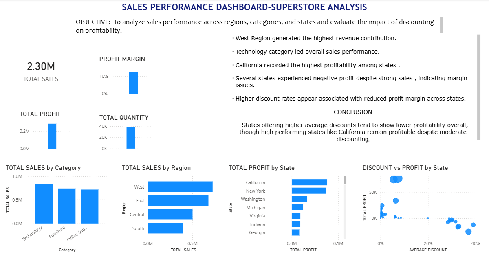

# 📊 Sales Performance Dashboard – Superstore Analysis

## 📌 Objective
To analyze sales performance across regions, categories, and states and evaluate the impact of discounting on overall profitability using Power BI.

---

## 🛠 Tools & Technologies Used
- Power BI
- DAX (Data Analysis Expressions)
- Data Cleaning & Transformation
- Data Visualization
- Business KPI Analysis

---

## 📈 Dashboard Overview

This project analyzes ~9,000+ sales transactions from the Superstore dataset to evaluate revenue performance, profitability trends, and the impact of discounting at regional and state levels.

The dashboard includes:

- KPI summary (Total Sales, Total Profit, Total Quantity, Profit Margin)
- Sales by Region
- Sales by Category
- Profit by State
- Discount vs Profit (Scatter Analysis)
- Interactive Region Slicer

---

## 🔍 Key Insights

- West region generated the highest revenue contribution.
- Technology category led overall sales performance.
- California recorded the highest profitability among states.
- Several states experienced negative profit despite strong sales, indicating margin inefficiencies.
- Higher discount rates (20%–40%) appear associated with reduced profit margins across states.

---

## 📊 Conclusion

States offering higher average discounts tend to show lower overall profitability. However, high-performing states such as California remain profitable despite moderate discounting, suggesting that sales volume and product mix also influence profitability.

---

## 📷 Dashboard Preview

---

## 📂 Files Included

- `Sales_Performance_Dashboard.pbix` – Power BI file
- `sales_dashboard.png` – Dashboard screenshot
- `README.md` – Project documentation

---

## 🚀 Future Improvements

- Add time-series sales trend analysis
- Perform deeper category-level margin analysis
- Build predictive model for discount optimization
